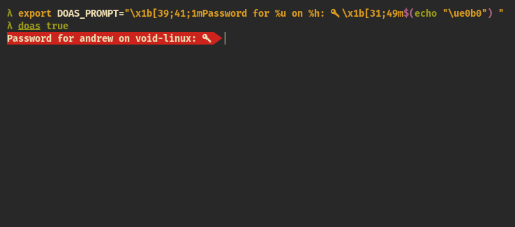

# OpenDoas-cmpr: a portable version of OpenBSD's `doas` command with the ability to set password prompt through the environment variables

All the information and documentation about OpenDoas itself can be found in [the original repo](https://github.com/Duncaen/OpenDoas "the original repo") or in the [Arch Wiki](https://wiki.archlinux.org/title/Doas "Arch Wiki")

This fork adds the ability to set password prompt and error message using the `DOAS_PROMPT` and `DOAS_AUTH_FAIL_MSG` environment variables
You can set background and foreground colors using ANSI escape codes. You can generate them using [this amazing website](https://ansi.gabebanks.net/ "escape code generator")

If you want to display username and/or hostname, just add %u and/or %h to your `DOAS_PROMPT`

Example of usage:

